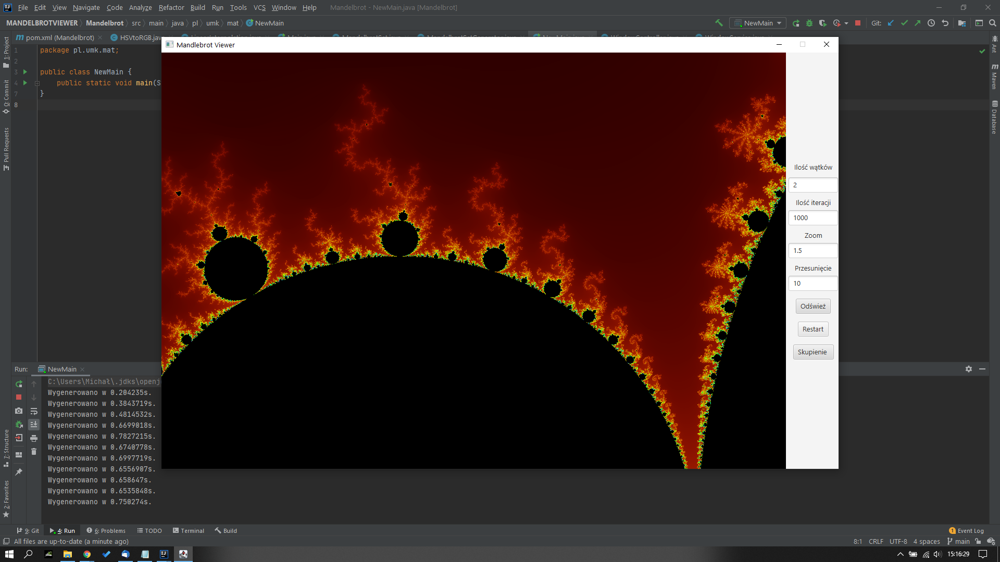

# MandelbrotSetViewer
Aplikacja desktopowa stowrzona w ramach zaliczenia wykładu z przedmiotu Programowanie równoległe i rozproszone

## Technologie
* Java 11
* JavaFx 14
* MySQL
* Wielowątkowość

## Screenshots

## Funkcjonalności
* Wizualizacja zbioru mandelbrota
* Kolorowanie zbioru
* Możliwość ustawienia parametrów
* Możliwość poruszania się po zbiorze

## Sterowanie
### Poruszanie się
W/A/S/D - poruszanie się po zbiorze odpowiednio góra/lewo/dół/prawo
LPM - zbliżenie i wyśrodkowanie zbioru w miejscu kliknięcia
PPM - oddalenie zbioru

### Pola
Ilość wątków - ilość wątków używana do wykonywania obliczeń
Ilość iteracji - określa szczegółowość zbioru
Zoom - określa krotność przybliżenia obrazu
Przesunięcie - określa o ile pixeli wykonany będzie ruch na zbiorze

### Przyciski
Odśwież - generuje zbiór
Restart - przywraca do ustawień początkowych
Skupienie - przycisk pozwalający skupić program na nasłuchiwaniu klawiatury do poruszania się po zbiorze
